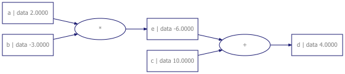

# micrograd_r

[Micrograd](https://github.com/karpathy/micrograd) is a minimalistic automatic differentiation library similar to PyTorch, created by Andrej Karpathy. This repo tries to port it to R using S7 OOP while learning along the way :).

#### Instantiate object

a <- Value(inp_data = 2.0, label = "a")

b <- Value(inp_data = -3.0, label = "b")

c <- Value(inp_data = 10.0, label = "c")

e <- a*b

e@label = "e"

d <- e + c

d@label = "d"

 
